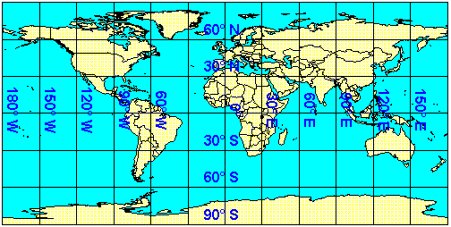
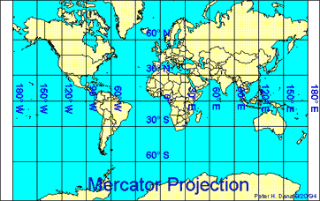
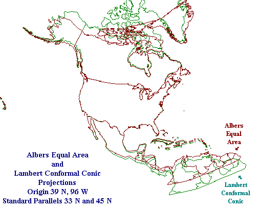

### Supported projections

|| Projection || Description || WKT name ||
| Mercator 1-standard parallel and Mercator 2-standard parallels | This map projection introduced in 1569 by Gerardus Mercator. It is often described as a cylindrical projection, but it must be derived mathematically. The meridians are equally spaced, parallel vertical lines, and the parallels of latitude are parallel, horizontal straight lines, spaced farther and farther apart as their distance from the Equator increases. This projection is widely used for navigation charts, because any straight line on a Mercator-projection map is a line of constant true bearing that enables a navigator to plot a straight-line course. It is less practical for world maps because the scale is distorted; areas farther away from the equator appear disproportionately large. On a Mercator projection, for example, the landmass of Greenland appears to be greater than that of the continent of South America; in actual area, Greenland is smaller than the Arabian Peninsula. | {{mercator}}, {{mercator_1sp}}, {{mercator_2sp}} |
| Transverse mercator | Universal (UTM) and Modified (MTM) Transverses Mercator projections. This is a cylindrical projection, in which the cylinder has been rotated 90°. Instead of being tangent to the equator (or to an other standard latitude), it is tangent to a central meridian. Deformation are more important as we are going futher from the central meridian. The Transverse Mercator projection is appropriate for region wich have a greater extent north-south than east-west. | {{transverse_mercator}} |
| Lambert Conic Conformal 2-standard parallel | The Lambert Conformal Conic projection is a standard projection for presenting maps of land areas whose East-West extent is large compared with their North-South extent. This projection is "conformal" in the sense that lines of latitude and longitude, which are perpendicular to one another on the earth's surface, are also perpendicular to one another in the projected domain. | {{lambert_conformal_conic}}, {{lambert_conformal_conic_2sp}}, {{lambert_conic_conformal_(2sp)}} |
| Albers | The Albers projection is most commonly used to project the United States of America. It gives the northern border with Canada a curved appearance. | {{albers}}, {{albers_conic_equal_area}} |

#### Pseudo-Plate Carré
Longitude and Latitude are projected directly to image-space by only applying a scale:


#### Mercator projection


#### Lambert and Albers compared
